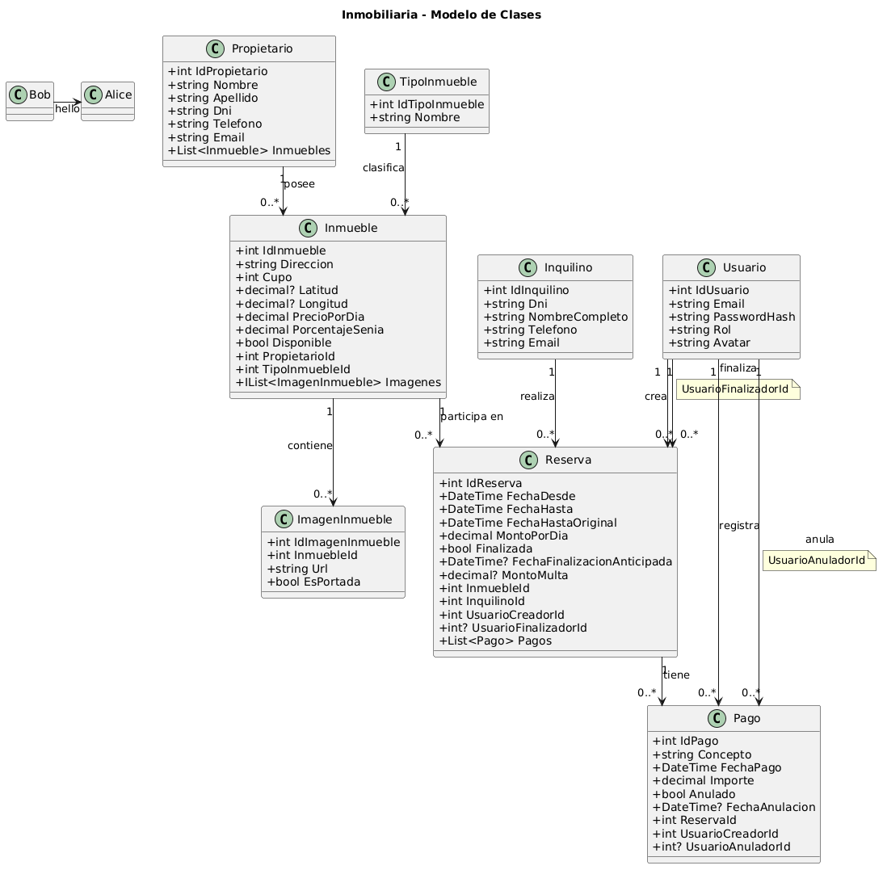

# Inmobiliaria-DeborahGomez

> Sistema para la gestión de alquileres temporarios de propiedades inmuebles que realiza una agencia inmobiliaria.

---

## 👥 Integrantes del Grupo

* **Dario Godoy** - *dariogodoy0896@gmail.com* - [@GodoyDario](https://github.com/GodoyDario)
* **Deborah Gomez** - *deborahgomez71@gmail.com* - [@debbieagomez](https://github.com/debbieagomez)
* **Ian Quimey Pereyra ** - *0108.facultad@gamil.com* - [@necoian](https://github.com/necoian)

---

## 📐 Modelado de Datos

A continuación se presenta el esquema del modelo de datos correspondiente a la aplicación:

### Diagrama Entidad-Relación (DER) / Diagrama de Clases



> **Nota:** la imagen se encuentra en la carpeta `/docs` del repositorio. También se incluye el código Mermaid original más abajo, desplegable.

<details>
<summary>Ver diagrama en código Mermaid (Opcional)</summary>

​```mermaid
classDiagram
    class Propietario {
        +int IdPropietario
        +string Nombre
        +string Apellido
        +string Dni
        +string Telefono
        +string Email
        +List~Inmueble~ Inmuebles
    }

    class TipoInmueble {
        +int IdTipoInmueble
        +string Nombre
    }

    class Inmueble {
        +int IdInmueble
        +string Direccion
        +int Cupo
        +decimal Latitud
        +decimal Longitud
        +decimal PrecioPorDia
        +decimal PorcentajeSenia
        +bool Disponible
        +string ImagenPortadaUrl
        +int PropietarioId
        +int TipoInmuebleId
    }

    class Inquilino {
        +int IdInquilino
        +string Dni
        +string NombreCompleto
        +string Telefono
        +string Email
    }

    class Reserva {
        +int IdReserva
        +DateTime FechaDesde
        +DateTime FechaHasta
        +DateTime FechaHastaOriginal
        +decimal MontoPorDia
        +bool Finalizada
        +DateTime? FechaFinalizacionAnticipada
        +decimal? MontoMulta
        +int InmuebleId
        +int InquilinoId
        +int UsuarioCreadorId
        +int? UsuarioFinalizadorId
        +List~Pago~ Pagos
    }

    class Pago {
        +int IdPago
        +string Concepto
        +DateTime FechaPago
        +decimal Importe
        +bool Anulado
        +int ReservaId
        +int UsuarioCreadorId
        +int? UsuarioAnuladorId
    }

    class Usuario {
        +int IdUsuario
        +string Email
        +string PasswordHash
        +string Rol
        +string Avatar
    }

    class RolUsuario {
        <<enumeration>>
        Administrador
        Empleado
    }

    Propietario "1" --> "0..*" Inmueble : posee
    TipoInmueble "1" --> "0..*" Inmueble : clasifica
    Inmueble "1" --> "0..*" Reserva : es_reservado_en
    Inquilino "1" --> "0..*" Reserva : realiza
    Reserva "1" --> "0..*" Pago : tiene
    Usuario "1" --> "0..*" Reserva : crea
    Usuario "1" --> "0..*" Pago : registra
    Usuario --> RolUsuario : tiene
​```

</details>

### Pasos para ingresar a MySQL Workbench e inicializar localmente la base de datos:

1. Ingresar a MySQL Workbench
2. Seleccionar opción Database (o el atajo de teclado Ctrl+U)
3. Colocar Connect to Database...
4. Ingresar a la conexión con las credenciales correspondientes de la computadora
5. Copiar, pegar y ejecutar el archivo de Database/DBInmobiliaria_DeborahGomez.sql
6. Refrescar conexión o seleccionar Reconnect to DBMS
7. Verificar en la pestaña Schemas
8. Corroborar que haya cargado la base de datos + sus respectivas tablas
9. Ingresa a la terminal posicionandose sobre Inmobiliaria-DeborahGomez
10. Ejecuta *dotnet user-secrets init*
11. Reemplaza TU-CONTRASEÑA por la de MySQL y ejecuta el siguiente comando: 
*dotnet user-secrets set "ConnectionStrings:MySqlConnection" "Server=localhost;Port=3306;Database=dbinmobiliaria_deborahgomez;Uid=root;Pwd=TU-CONTRASEÑA;"*
12. Verificar con *dotnet user-secrets list* si aparece el ConnectionStrings correspondiente
13. Ya puedes ejecutar la aplicacion *dotnet run*